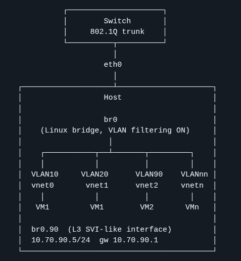

# VLAN-aware Linux bridge with systemd-networkd (host + VLAN-isolated VMs)

This repo demonstrates a deterministic, version-controlled Linux networking setup using `systemd-networkd` and VLAN-aware brige:

- `eth0` as an 802.1Q trunk
- `br0` as a VLAN-aware Linux bridge (`VLANFiltering=yes`)
- VLAN 90 routed on the host via `br0.90`
- VMs connected to `br0` with VLAN separation enforced on the host side (libvirt VLAN tags)
- Validation commands included




## Deep dive

VLAN‑aware bridge filtering is a hot topic in FreeBSD 15 discussions; this write‑up shows the Linux implementation.
[`docs/writeup.md`](docs/writeup.md)

## Why this exists (DevOps angle)

- Declarative networking configuration (`/etc/systemd/network`) you can track in Git
- Reproducible host setup (install script)
- Clear verification steps (verification script)
- Easy to extend into **Ansible/GitOps**

## Contents

- [`docs/architecture.md`](docs/architecture.md) — topology + responsibilities (L2 vs L3)
- [`docs/decisions.md`](docs/decisions.md) — design tradeoffs & rationale
- [`docs/writeup.md`](docs/writeup.md) — full write-up and deep dive
- [`docs/verification.md`](docs/verification.md) — how to validate the setup
- [`systemd-networkd/`](systemd-networkd/) — config files to deploy on the host
- [`libvirt/`](libvirt/) — example VM NIC definitions (access VLAN and trunk)
- [`scripts/`](scripts/) — install + verify helpers

## Quick start (host)

> ⚠️ Networking changes can lock you out. Use console access or out-of-band management.

1) Copy files into `/etc/systemd/network/` (see [`scripts/install-networkd-config.sh`](scripts/install-networkd-config.sh))
2) Restart networkd:
```bash
sudo systemctl restart systemd-networkd
```
3) Verify
```bash
./scripts/verify.sh
```
